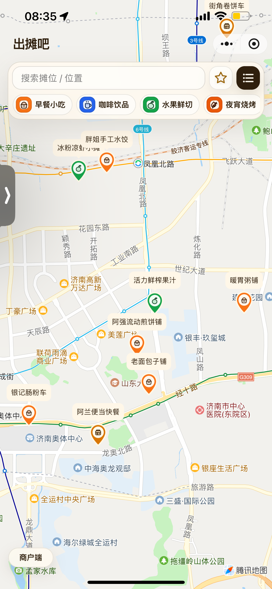
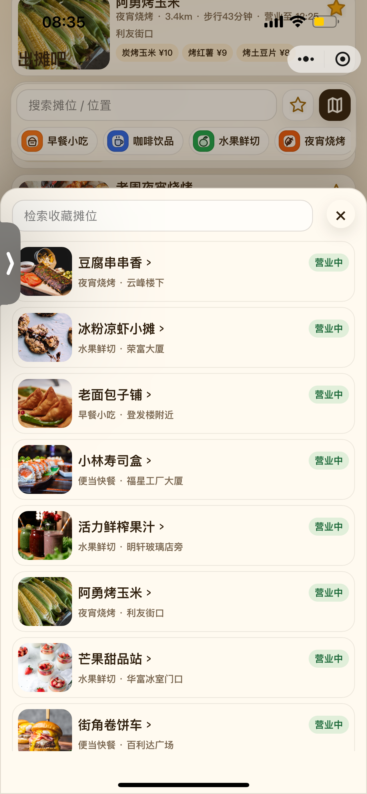
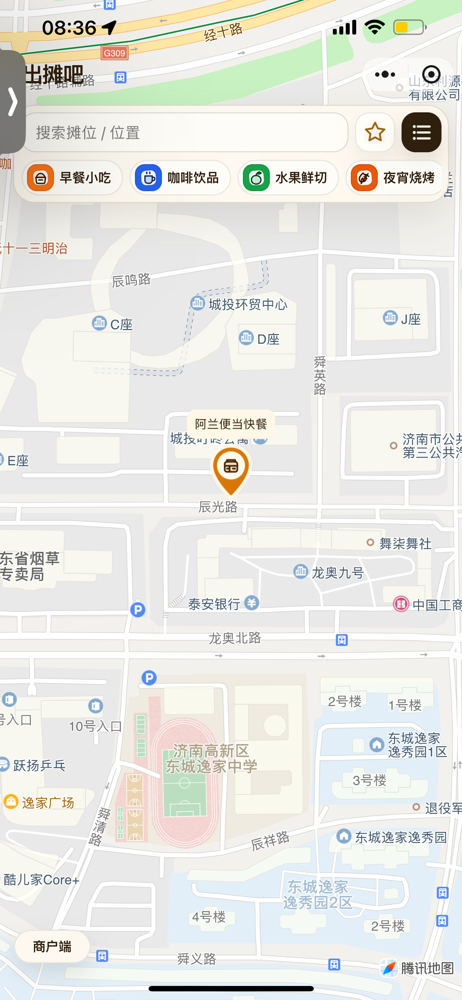
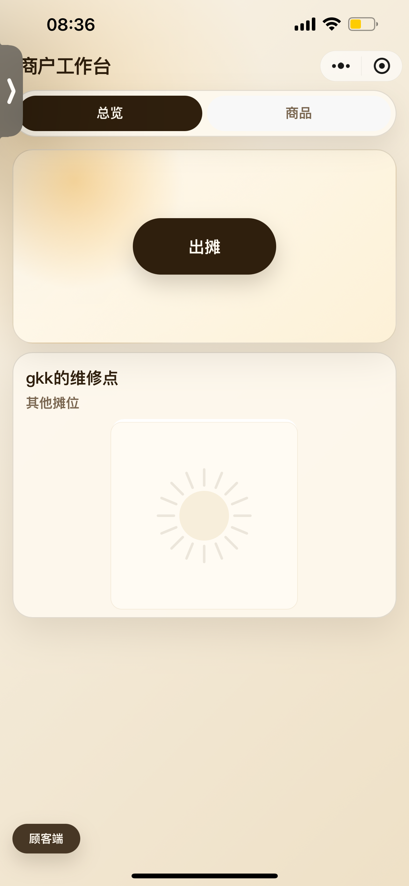
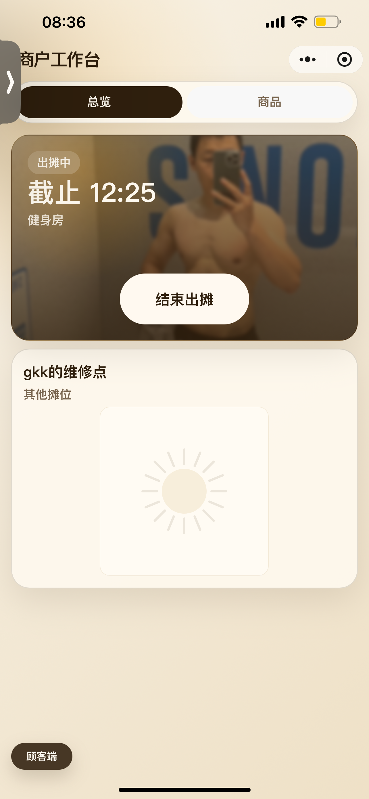

# 出摊啦 / Stall Location

「出摊啦」是一个面向流动摊主和顾客的附近商户应用。项目由 uni-app 前端和 Go/gkk 后端组成，支持微信小程序与 H5 调试：顾客可以查看附近营业摊位、进入商户商品弹窗、收藏商户、申请成为商户并提交反馈；商户可以维护资料、开始/结束出摊、管理商品、置顶商品和分享二维码；后台可以处理申请、商户、订单、反馈和活跃出摊数据。

## 页面预览

### 顾客端

<table>
  <tr>
    <td align="center" width="33%">
      
      <br />
      <sub>附近商户列表</sub>
    </td>
    <td align="center" width="33%">
      
      <br />
      <sub>地图模式</sub>
    </td>
    <td align="center" width="33%">
      
      <br />
      <sub>收藏列表</sub>
    </td>
  </tr>
  <tr>
    <td align="center" width="33%">
      
      <br />
      <sub>商户详情弹窗</sub>
    </td>
    <td align="center" width="33%">
      
      <br />
      <sub>产品图片预览</sub>
    </td>
    <td align="center" width="33%">
      
      <br />
      <sub>地图商户详情</sub>
    </td>
  </tr>
</table>

### 商户端

<table>
  <tr>
    <td align="center" width="33%">
      
      <br />
      <sub>商户工作台</sub>
    </td>
    <td align="center" width="33%">
      
      <br />
      <sub>出摊状态</sub>
    </td>
    <td align="center" width="33%">
      
      <br />
      <sub>商品管理</sub>
    </td>
  </tr>
</table>

## 项目结构

```text
stall-location/
├── backend/                         # Go + Fiber + GORM + gkk 后端
│   ├── cmd/server                    # 服务入口
│   ├── internal/api                  # 路由注册
│   ├── internal/model                # GORM 模型、响应投影、hook
│   ├── internal/query                # 查询参数和 DB scope
│   ├── internal/service              # 出摊、附近、申请、反馈、订单、分享图等复杂业务
│   ├── internal/conf                 # custom 配置映射
│   ├── internal/bootstrap            # 服务注册、schema 准备、demo seed
│   ├── gkk                           # 项目内置 gkk 框架
│   ├── API_GUIDE.md                  # 前端接口文档
│   └── README.md                     # 后端说明
├── frontend/                         # uni-app 前端，支持 H5 和微信小程序
│   ├── src/api                       # 前端 API 封装
│   ├── src/pages/customer/index.vue  # 顾客/申请/商户主页面
│   ├── src/manifest.json             # 小程序配置
│   ├── src/pages.json                # 页面配置
│   └── README.md                     # 前端说明
├── docs/                            # 项目补充文档目录
└── release/                         # 构建产物目录
```

## 技术栈

| 层 | 技术 |
| --- | --- |
| 前端 | uni-app、Vue 3、Vite、微信小程序、H5 |
| 后端 | Go、Fiber v3、GORM、gkk |
| 数据库 | PostgreSQL |
| 上传 | 阿里云 OSS |
| 微信 | 小程序登录、公众号 OAuth/JS-SDK/扫码能力 |
| 部署 | 前后端分离，或 Go 服务代理 H5 构建产物 |

## 核心业务能力

### 顾客端

- 默认进入附近商户列表，按定位距离排序。
- 支持列表/地图切换、分类筛选、关键词检索。
- 点击商户卡片打开商品弹窗；地图入口展示单个或附近摊位。
- 收藏商户，收藏列表展示商户和营业状态。
- 提交入驻申请，进入申请页面。
- 提交反馈和上传图片。

### 商户端

- 查看和更新商户资料、头像/营业照片、分享信息。
- 开始出摊、结束出摊；到预计结束时间后后端定时任务自动结束出摊。
- 管理商品：创建、更新、删除、上架/下架。
- 商品置顶：单商户最多 3 个置顶商品；公开卡片读取 `merchant.products` 摘要。
- 分享二维码：商户固定 `share_code`，H5 分享和小程序 scene 都使用该值。

### 后台端

- gkk 后台账号登录、续期、用户/菜单/角色管理。
- 入驻申请列表、详情、审核通过、审核拒绝。
- 商户列表和状态管理。
- 订单列表、后台取消、后台退款标记。
- 反馈列表和处理。
- 活跃出摊列表。

## 登录和页面模式

前端登录后请求：

```http
GET /api/customer/me
token: <jwt>
```

根据 `page_mode` 分流：

| `page_mode` | 页面 | 后续接口 |
| --- | --- | --- |
| `customer` | 顾客首页 | `/api/pub/*`、`/api/customer/favorites`、`/api/customer/feedback` |
| `application` | 入驻申请页 | `/api/customer/applications` |
| `merchant` | 商户工作台 | `/api/merchant/me`、`/api/merchant/stalls`、`/api/merchant/products` |

鉴权请求头统一使用：

```http
token: <jwt>
```

写接口成功通常返回 HTTP 200 空 body，前端请求封装需要把 200 视为成功，不能强制解析 JSON。

## 本地开发

### 1. 启动后端

准备 PostgreSQL，并确认 `backend/config.yaml` 中的数据库、OSS、微信和 CORS 配置。

```bash
cd backend
go mod download
go run ./cmd/server
```

默认后端地址：

```text
http://localhost:8080
```

### 2. 启动前端 H5

```bash
cd frontend
npm install
npm run dev:h5
```

常用本地入口：

```text
http://localhost:5173/
```

`frontend/.env.development` 通过 `VITE_API_BASE` 指向后端 API。H5 调试时 Vite 会把 `/api` 代理到该地址。

### 3. 启动微信小程序构建

```bash
cd frontend
npm run dev:mp-weixin
```

微信开发者工具导入：

```text
frontend/dist/dev/mp-weixin
```

生产构建：

```bash
cd frontend
npm run build:mp-weixin
```

微信开发者工具导入：

```text
frontend/dist/build/mp-weixin
```

## 前端环境变量

| 变量 | 说明 |
| --- | --- |
| `VITE_API_BASE` | API 根地址；H5 和小程序请求都会基于它访问 `/api`。 |
| `VITE_CUSTOMER_TOKEN` | 本地调试用固定 token；为空时走小程序登录。 |

示例：

```bash
VITE_API_BASE=http://localhost:8080
VITE_CUSTOMER_TOKEN=
```

生产 H5 配置示例：

```bash
VITE_API_BASE=https://tougao-api.wukongkeyan.com
```

## 后端关键配置

`backend/config.yaml` 示例结构：

```yaml
server:
  domain: "http://localhost:8080"
  port: "8080"
  cors:
    - "http://localhost:5173"

db:
  db: "postgres"
  name: "near"
  user: "postgres"
  password: "***"
  host: "127.0.0.1"
  port: "5432"

auth:
  mini:
    appid: "小程序 appid"
    key: "小程序 secret"
  appid: "公众号 appid"
  key: "公众号 secret"

oss:
  bucket: "bucket"
  domain: "https://oss.example.com"
  endpoint: "oss-cn-beijing.aliyuncs.com"
  id: "***"
  pwd: "***"

custom:
  share_url: "http://localhost:5173"
  seed_demo_data: true
  frontend: "../frontend/dist/build/h5"
  max_merchant_products: 50
  max_customer_favorites: 50
```

配置结论：

- `server.cors` 必须包含前端域名。
- `auth.mini.appid/key` 完整时注册小程序登录 `/api/Wx/mini`。
- `custom.share_url` 用于拼接 H5 分享链接。
- `custom.frontend` 指向 H5 构建目录后，Go 服务可以代理页面到 `/`。
- `max_merchant_products` 控制单商户商品总数，默认 50。
- `max_customer_favorites` 控制单顾客收藏总数，默认 50。

真实数据库密码、OSS 密钥、公众号/小程序 secret 不要提交到公开仓库。

## API 文档

给前端开发使用的完整接口说明：

- `backend/API_GUIDE.md`

主要接口分组：

| 分组 | 鉴权 | 用途 |
| --- | --- | --- |
| `POST /api/upload` | 前台 token | 文件上传；支持 `preset=stall_photo` 输出 `1280x720`，`preset=product` 输出 `800x600`。 |
| `/api/pub/*` | 无 | 附近摊位、公开商户详情、商户出摊状态、公开商品。 |
| `/api/customer/*` | 前台 token | 登录用户、入驻申请、反馈、收藏。 |
| `/api/merchant/*` | 商户 token | 商户资料、出摊、商品、商品置顶。 |
| `/api/sys/*` | 后台 token + RBAC | 后台用户、菜单、角色和业务管理。 |
| `/api/Wx/*` | 按接口区分 | 小程序登录、公众号 OAuth、JS-SDK、扫码、素材。 |

## 常用命令

```bash
# 后端启动
cd backend && go run ./cmd/server

# 后端测试
cd backend && go test ./...

# 后端当前平台编译
cd backend && go build -o server ./cmd/server

# 后端 Linux x86_64 编译
cd backend && GOOS=linux GOARCH=amd64 go build -o ../release/stall-location-linux-amd64 ./cmd/server

# 前端 H5 开发
cd frontend && npm run dev:h5

# 前端 H5 生产构建
cd frontend && npm run build:h5

# 前端微信小程序开发构建
cd frontend && npm run dev:mp-weixin

# 前端微信小程序生产构建
cd frontend && npm run build:mp-weixin
```

## 部署模式

### 前后端分离

- H5 前端部署到静态托管平台。
- 小程序包通过微信开发者工具上传。
- 后端部署为 Go 服务，域名提供 `/api`、`/api/Wx`、上传和后台接口。
- 前端 `VITE_API_BASE` 设置为后端域名。
- 后端 `server.cors` 包含前端域名。
- 后端 `custom.share_url` 设置为 H5 分享域名。

### Go 服务代理 H5 页面

- 执行 `cd frontend && npm run build:h5`。
- 将 `backend/config.yaml` 的 `custom.frontend` 指向 H5 构建目录。
- Nginx 反向代理到 Go 服务。
- Go 服务同时负责 `/api` 和 `/` 页面 fallback。

## 当前文档入口

- 后端说明：`backend/README.md`
- 前端说明：`frontend/README.md`
- 接口与业务逻辑：`backend/API_GUIDE.md`

## 许可证与署名

- 本项目使用 GitHub 可识别的 `AGPL-3.0` 许可证：`LICENSE`
- `AGPL-3.0` 要求保留版权与许可证声明，网络服务修改版本需要向用户提供对应源码。
- 不得移除版权声明、许可证声明或冒名发布。
